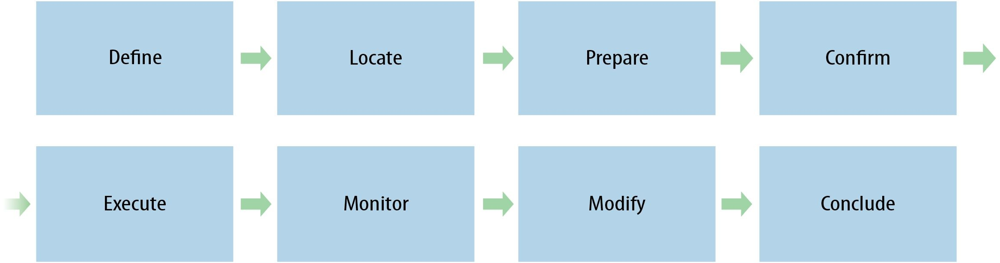
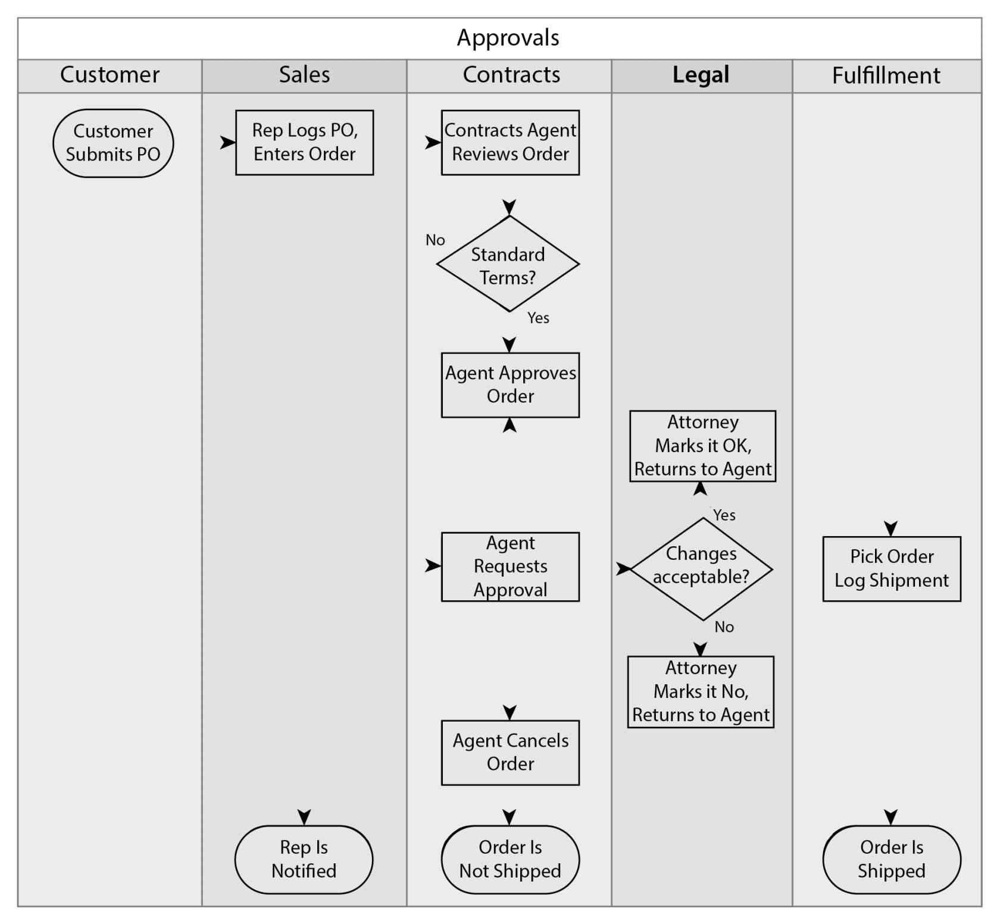

# Mapping Experiences
### Jim Kalbach
O'Reilly Media, 2016

|

## Chapter 10: Customer Journey Maps

### Background
The exact origin of the term *customer journey map* (CJM) is unclear. The
basic idea of looking across touchpoints seems to have its roots in Jan
Carlzon’s concept of moments of truth. (See Chapter 2 for more on
moments of truth.) Carlzon advocated an ecological view of the customer
experience, but he never explicitly talked about a map of the customer
journey as such.

It wasn’t until the field of customer experience management came into
focus just before the turn of the century that journey mapping emerged.
For instance, in a seminal article appearing in *Marketing Management* in
1994, authors Lewis Carbone and Stephan Haeckel speak of an
*experience blueprint*, which they define as “a pictorial representation of
the experience clues to be engineered, along with specification that
describes them and their individual functions.”

In 2002, customer experience expert Colin Shaw introduced the concept
of what he calls *moment mapping*—recalling Carlzon. The resulting
diagram (Figure 10-1) uses an arrow to map the phases of the customer
experience.

From this, analysis opportunities for creating a positive customer
experience can be derived, shown in Figure 10-2.
As a type of diagram, CJMs are derived from service blueprinting. For
sure, the two types of diagrams are similar, particularly in structure (i.e.,
chronological). But there are also differences in point of view, scope,
focus, and use.

#### FIGURE 10-1: Colin Shaw's description of the elements of a moment map resembles contemporary CJMs

#### FIGURE 10-2: A moment map table from Colin Shaw and John Ivens’s book Building Great Customer Experiences (2002) includes emotional aspects of a customer journey.

The contemporary style of CJMs seems to have come about in the mid2000s.
Bruce Temkin, a leading customer experience expert, is one of
the early advocates for CJMs and greatly promoted their use in the USA.
In a Forrester report entitled “Mapping the Customer Journey,” Temkin
defines CJMs as “documents that visually illustrate customers’
processes, needs, and perceptions throughout their relationships with a
company.”

Temkin points to the significance of CJMs in his later blog post “It’s All
About Your Customer’s Journey”:
> Companies need to use tools and processes that reinforce an
> understanding of actual customer needs. One of the key tools in
> this area is something called a customer journey map…Used
> appropriately, these maps can shift a company’s perspective
> from inside-out to outside-in.

Figure 10-3 shows an example of a CJM created by Jamie Thomson of
Mad*Pow. It visualizes a year of engagement in a high-level way that
helped the product team see how game mechanics and coaching
communications could work together. The aim was to support and nudge
the player along a path toward his health goals.

#### FIGURE 10-3. Customer journey map showing a one-year journey of a person playing a health behavior change game (created by Jamie Thomson).

Figure 10-4 shows another example, in this case for a broadband
provider. This CJM was created by Effective UI, a leading digital
experience consultancy. It includes a very prominent emotional curve in
the center. This clearly suggests that many factors come into play, chief
among these the emotional experience.

CJMs typically focus on the relationship of an individual as a customer of
an organization. Frequently, they highlight some decision-making
process. In Figure 10-4, the “Purchase” phase highlights the decision to
buy.

But CJMs are versatile and have a range of uses. They are often used to
better understand customer loyalty and how to improve existing
customers’ experiences. They help answer such questions as: How can
an organization better engage customers? How can it provide value that
keeps them coming back? How can it make services more relevant?

Creating great experiences is not about individual touchpoint optimization
but rather how touchpoints come together into a unified whole. CJMs are
a strategic tool to visualize touchpoints to manage them more effectively.

The *customer journey canvas* (Figure 10-5) is a variation of a CJM that is
particularly good for getting input from the entire team. The open canvas
arrangement invites others to contribute. The customer journey canvas
was created by service design experts Marc Stickdorn and Jakob
Schneider for their influential book *This Is Service Design Thinking*. The
canvas-style template allows teams to audit their customer’s journey
together.

The basic format of the customer journey canvas reveals both frontstage
and backstage components to the service experience. It aligns such
things as pre-service actions of the provider to customer expectations, as
well as how the provider will manage customer relationships over time
after a service encounter.

#### FIGURE 10-4. This example of a CJM for a broadband provider, created by Effective UI, focuses on emotional aspects of a journey.

#### FIGURE 10-5. The customer journey canvas created by Marc Stickdorn and Jakob Schneider is a variation of the typical CJM.

### Customer Lifecycle Maps

Some practitioners also make a distinction between CJMs and customer
lifecycle maps. The latter are broader yet and deal with the lifetime
relationship between a customer and an organization. Customer
lifecycles typically include slightly more abstract phases that reflect an
overall relationship rather than a specific journey.

The history of customer lifecycle planning can be traced back to the early
1960s. For instance, Russell Colley developed a framework for
evaluating advertising success in a book titled *Defining Advertising Goals
for Measured Advertising Results*. The technique is referred to as
DAGMAR for short. This model had several phases of interaction, from
*awareness* to action. In 1961, Robert Lavidge and Gary Steiner offered a
similar model.

From these models and others formed during the 1960s, John Jenkins developed one of the earliest comprehensive lifecycle diagrams in his
1972 book *Marketing and Customer Behaviour*. Figure 10-6 shows his
original model, which he calls the market continuum model.

#### FIGURE 10-6. John Jenkins’s model of the customer lifecycle (1972) represents perhaps the earliest example of a journey map.

From this perspective, a customer lifecycle map is about overall brand
loyalty and the emotional connection to an organization as a whole, not
just a product or service. CJMs are more about a particular type of
engagement within that lifecycle, and example service blueprints
historically center on specific types of service encounters. Figure 10-7
illustrates the approximate relationship of these three views: customer
lifecycles, CJMs, and service blueprints—in this case, for the experience
of buying and owning a car.

These distinctions are broad generalizations and not absolutes. The
relationship between these approaches is not strictly hierarchical. What’s
more, in the field, these terms are used interchangeably. Many people
refer to customer lifecycles as CJMs, and holistic service blueprints may
show the end-to-end experience. In any case, don’t get hung up on
labels: focus instead on telling the story of value creation.

#### FIGURE 10-7. Customer lifecycles look at the overall relationship to a brand. Customer journey maps look at a particular type of engagement. Service blueprints typically analyze specific types of service encounters.

### Related Models
Outside of commercial settings, Everett Rogers uncovered the complexity
of adoption of new products. In his landmark book *Diffusion of
Innovations*, Rogers outlines his *innovation-decision* process based on
decades of research (Figure 10-8).

#### FIGURE 10-8. The innovation-decision process, first described by Everett Rogers.

Though dating back to the 1960s, this process resembles typical phases
of modern CJMs. In fact, John Jenkins cites Rogers’s model as a direct
influence on the early map shown in Figure 10-6.

The attitude of the individual during the *persuasion phase*, in particular, is
critical. Rogers was able to narrow down predictors of decision-making in
this phase to a set of five basic principles. These are the questions
decision makers ultimately ask before adopting a new product or service:

* Relative advantage. Is it better than existing alternatives?
* Compatibility. Is it appropriate? Does it fit into my beliefs and values?
* Complexity. Is it easy to comprehend and use?
* Trialability. Can it be tested without penalty?
* Observability. Can it be observed and understood?

If most are answered affirmatively, the chance of adoption is higher. In
other words, these are the key factors that influence the decision-making
process.

Keep in mind that these are *perceived* characteristics. That is, the
perception of value is in the mind of the customer, not an absolute
property of a product or service. Similarly, CJMs seek to understand how
an offering is actually perceived by customers, from their vantage point.

### The Conversion Funnel
The decision to make a purchase is typically seen as a funnel (Figure 10-
9). The exact phases or steps along the way can vary, depending on how
the funnel is conceived.

#### FIGURE 10-9. Typical marketing funnel showing progression through the customer journey.

The metaphor suggests that people enter into a wide opening and get
funneled into making a purchase. But at various points, there are
decisions to leave the process, thereby reducing the number of people
that continue all the way to conversion.

Market researchers at McKinsey and Company suggest a new model,
which they call the *consumer decision journey*. They believe consumers
are increasingly changing the way they research and buy products and
services. They do much more upfront research and comparison than ever
before, particularly online. (See the sidebar, “Zero Moment of Truth” in
Chapter 2 for more on these shifts.)

Figure 10-10 reflects their updated decision-making model.

#### FIGURE 10-10. The consumer decision journey, as visualized by consultants at McKinsey, changes the basic notion of a funnel.

The circular arrangement of this model reflects a need to reevaluate how
consumers go through their decision-making process. In this age of
empowered consumers, the process is more circular. One person’s
experiences after purchase become the next person’s evaluation criteria.
With this model, there is no more “top of the funnel” where consumers
enter en masse.

### Elements of CJMs
CJMs aren’t mere inventories of touchpoints. They include deeper insight
into the motivations and attitudes of customers. What makes them
purchase? What keeps them satisfied? These are the types of questions
a CJM needs to address.

Consider the elements and structure of the map in Figure 10-11. Each
touchpoint is clearly indicated in the middle across different channels.
Below those are actual satisfaction scores from quantitative sources.

#### FIGURE 10-11. A CJM for purchasing health insurance, created by Jim Tincher at Heart of the Customer, shows the typical elements.

CJMs are decidedly less formulaic than service blueprints. They can
include a number of different elements and information types, such as
pain points, moments of truth, brand perception, and more. The creator of
a CJM should include aspects appropriate to an organization’s needs.
Some typical elements of CJMs include actions, goals, emotions, pain
points, moments of truth, touchpoints, satisfaction, and opportunities.

Table 10-1 summarizes the main aspects that define customer journey
maps using the framework outlined in Chapter 2.

#### **Table 10-1**: Defining aspects of customer journey maps

| **Point of view** | Individual as consumer |
| **Structure** | Chronological |
| **Scope** | End-to-end experience, from recognizing a need to ending the relationship. Often centered on a single person’s journey, but can also show a holistic, aggregate map across personas and touchpoints |
| **Focus** | Focus primarily on the consumer experience, with very little on backstage processes |
| **Uses** | Used for touchpoint analysis and optimization. Strategic planning for customer experience management, marketing, and branding initiatives |
| **Strength** | Simple to understand, Widespread use, Suitable for co-creation with teams and stakeholders |
| **Weaknesses** | Typically view individuals as consumers. Often leave out internal processes and actors |

|

---

### Customer Journey Mapping
by Jim Tincher, Mapper-in-Chief, *Heart of the Customer*

Seeking to identify specific ways to boost loyalty and referrals among
its radiology patients, Meridian Health reached out to the customer
journey map experts at Heart of the Customer (HotC).

HotC’s Mapper-in-Chief, Jim Tincher, and his team worked with
Meridian’s Vice President of Marketing, Chrisie Scott, and Director of
Experience Marketing, Tria Deibert, to identify several key customer
segments (personas) to focus on in creating their customer journey
maps, to shed light on the differing needs of each type of patient, and
to explore what they were thinking and feeling during each step of
their healthcare experience.

They began with a hypothesis based on input from internal staff: that
scheduling difficulties were the primary source of customer
frustration. But as is often the case in journey mapping, it soon
became apparent that the touchpoints employees believed to be
problematic were not actually causing friction for customers.

Data gathered from dozens of patients through journaling exercises
and more than half a dozen focus groups during the early stages of
the mapping process revealed that patients found Meridian’s
scheduling and registration procedures to be straightforward and
smooth, with particularly high marks given to their caring and
competent staff. Patients were also quite satisfied with other
touchpoints that were identified during the mapping process,
including the actual treatment they received.

At the same time, highlighted moments of truth revealed an issue
that did need to be addressed: many patients didn’t know what to
expect at different stages of their journey, and weren’t initially offered
guidance to navigate from step to step.

Focusing on two of the journey maps HotC created for Meridian—
those representing patients on either end of the experience spectrum
—illustrates the unique value of customer journey mapping.

On one end, there’s Seen-it-all Stanley (Figure 10-12), a heavy
healthcare user whose familiarity with “the system” tempers both his
expectations and his anxiety level. He knows to leave a little extra
time for parking, he can relax and enjoy watching TV in the waiting
room until he’s called in, and he knows when he can expect his test
results.

Minor inconveniences or delays don’t faze Stanley because he
knows he’s in good hands. Meridian has already earned his loyalty,
and needs only to maintain the high level of service it already
provides in order to keep it.

On the other end of the spectrum is Newbie Natalie (Figure 10-13),
who is “learning the ropes” as she navigates Meridian’s radiology
services for the first time. Understandably, Newbie Natalie is more
nervous, which magnifies the negative impact of friction during any
touchpoint in her journey.

Parking difficulties get Natalie’s visit off to a bad start, and not
knowing when to expect her test results unnecessarily adds to her
already elevated anxiety level. As a result, even though she is
satisfied with the treatment she receives, and even though those
kinds of problems are unlikely to recur on subsequent visits, they
negatively impact her overall experience.

That finding was key to determining where to focus future customer
engagement efforts, because Natalie won’t be a Newbie for long. If
her first experience is peppered with uncertainty and inconvenience,
regardless of how minor, she will have little incentive to choose
Meridian next time around.

So therein lay Meridian’s greatest opportunity: meet Natalie’s needs
today, so that she can transition into a loyal, satisfied Seen-it-all
Stanley tomorrow.

With that information and completed customer journey maps in hand,
HotC moved on to the action component of the customer journey
mapping process by leading workshops to brainstorm and prioritize
ways to improve Newbie Natalie’s experience.

Once it was determined that better communication was key, Meridian
was able to devise ways to provide clearer, more specific guidance
for each step of her journey. In doing so, Meridian keeps her anxiety
to a minimum, helps her avoid unnecessary inconvenience, and
provides the information that allows her to frame realistic
expectations.

Had Meridian not engaged HotC to create customer journey maps
and instead—per staffers’ initial perceptions of what the priority
should be—focused on “improving” their scheduling and registration
processes, not only would their efforts have been fruitless, they might
even have decreased customer satisfaction by tampering with a
system with which patients were happy. Instead, customer journey
mapping illuminated simple, effective steps Meridian could take to
turn anxious new patients into loyal and satisfied healthcare users.
About the Contributor

Heart of the Customer Mapper-in-Chief Jim Tincher sees the world in
a special way: through the eyes of customers.

With a lifelong passion for customer experience, Jim founded HotC
to help companies of all sizes increase customer engagement.
Before launching the company, Jim led customer engagement
initiatives at Best Buy and UnitedHealth Group. In the process, he
became an expert in using Voice of the Customer research to identify
unmet needs, develop new products, and improve customer service.
His *HotC Journey Maps* are a powerful tool designed with one simple
goal: customer loyalty.

Jim’s fascination with customer experience also led him to become a
Certified Customer Experience Professional. He is also an active
member of the Customer Experience Professionals Association
(CXPA), serving as one of their CX Experts and providing advice to
members worldwide.

#### FIGURE 10-12. Customer journey map for Seen-it-all Stanley, created by Heart of the Customer for Meridian (journey map design by Design Ahead).

#### FIGURE 10-13. Customer journey map for Newbie Natalie, created by Heart of the Customer for Meridian (journey map design by Design Ahead).

### Diagram and Image Credits
Figures 10-1 and 10-2: Moment map diagram and table from Colin Shaw
and John Ivens. Building Great Customer Experiences (Palgrave
Macmillan, 2002)

Figure 10-3: Customer journey map created by Jamie Thomson
(Mad*Pow), originally appearing in Megan Grocki, “How to Create a
Customer Journey Map” UX Mastery (Sep 2014), used by permission.

Figure 10-4: An example of a CJM for a broadband provider, created by
Effective UI, used with permission

Figure 10-5: The customer journey canvas created by Mark Stickdorn
and Jakob Schneider, from This Is Service Design Thinking, CC BY-SA
3.0

Figure 10-6: Model of the customer lifecycle by John Jenkins from his
book Marketing and Customer Behaviour (Pergamon Press, 1972)

Figure 10-10: David Court et al. “The Consumer Decision Journey,”
McKinsey Quarterly (Jun 2009)

Figure 10-11: CJM by Jim Tincher, used with permission.
http://www.heartofthecustomer.com/customer-experience-journey-mapthe-top-10-requirements/

Figure 10-12: Map created by Jim Tincher, Heart of the Customer,
designed by Design Ahead (http://www.designahead.com), used by
permission from HotC and Meridian

## Chapter 11: Experience Maps

### Overview
As the Internet continues to grow and evolve, service ecosystems
become more complex. Products are connected. The idea of a
standalone offering is already something of the past. Building the
proverbial better mousetrap does not necessarily win anymore.

Instead, thinking in terms of ecosystems is the new competitive
advantage. Steve Denning, a popular business writer with *Forbes*
magazine, puts it this way.

> Even better products can disappear with alarming rapidity. By
contrast, ecosystems that delight customers are difficult to build,
but once built, are difficult to compete against.

Successful organizations will be determined by how well their services fit
with each other and, more importantly, how well they fit into people’s
lives.

Ecosystem design doesn’t apply only to large organizations. GOQii, for
example, is a small company that makes a wearable fitness band. But
unlike other bands, this one is connected to a trainer, who provides
personalized health feedback. Meeting daily goals set by the trainer
earns Karma points, which users can then donate to good causes.
By connecting activities around the field of fitness, GOQii created an
ecosystem of experiences. This is an implicit part of the GOQii value
proposition, reflected in their customer-facing diagrams, as seen in Figure 11-1.

Systems are now multifaceted and bring complexity with them. Hugh
Dubberly, renowned designer and business consultant, believes models
are an antidote. In an interview, Dubberly states:

> We need models for planning systems, for thinking about the
> elements and the rules together, for thinking about how systems
> integrate with other systems embedded in systems of yet more
> systems. We need models not just of what appears on computer
> screens, not just of pathways, not just of interactions. We now also
> need models of goals and contexts. We need models of abstract
> ideas.

#### FIGURE 11-1. The GOQii.com ecosystem includes a fitness band, an app, coaches and experts, and donations of Karma points earned.

Alignment diagrams represent these types of models. Experience maps,
in particular—the topic of this chapter—look at the broader context of
human activity, beyond the offerings of just one organization. They show
the connections between people, places, and things, and they aid in the
design of ecosystems.

### Maps of Experiences
By some definitions and uses, *experience maps* overlap completely with
*customer journey maps*. For sure, the two terms are used
interchangeably in practice. You may even find a mashup of terminology
as well, with phrases such as “customer experience maps” and
“experience journeys.” Don’t worry about the semantic differences of
these labels. Instead, focus on the story you need to tell in your
organization.

That said, there are general differences between experience maps and
customer journey maps we can point to. Customer journey maps tend to
view the individual as a consumer of the products and services. As the
name implies, they are about the relationship of an individual as a
customer of a specific service.

Experience maps, on the other hand, typically focus on a general human
activity within a given domain. The company or organization may not
even be explicitly stated, or there may be many organizations involved.

From this standpoint, experience maps separate experiences from
solutions. They help shift an organization’s collective thought from
features or internal processes toward the desired outcomes people seek.

> Successful organizations will be
> determined by how well their services
> fit with each other and, more
> importantly, how well they fit into
> people’s lives.

One of the earliest examples of an experience map comes from Gene
Smith and Trevor von Gorp of nForm, a leading experience design
agency in Canada. Figure 11-2 shows their map for a video game
enthusiast.

#### FIGURE 11-2. This experience map for social gamers shows a clear chronology from left to right.

Although this map includes a purchase phase, that is not the focus of the
diagram. Smith describes how their motivation was to understand the
context of gaming in greater depth in his blog post entitled “Experience
Maps: Understanding Cross-Channel Experiences for Gamers.” He
writes:

> The solution we came up with was an experience map—a diagram
> that combines a persona with an abstracted story about the
> gamer’s journey from researching games to purchasing, playing to
> sharing experiences about that game. The story includes the
> details on the different channels where gamers get their
> information along with supporting quotes from our research.

Experience maps fundamentally recognize that people interact with many
products and services from a multitude of providers in many situations.
These experiences shape their behaviors and their relationship with any
one organization. Examining this broader context will become
increasingly crucial as products and service become connected with each
other.

Consider the map shown in Figure 11-3, created by Diego S. Bernardo, a
design strategist in Pittsburgh, Pennsylvania. His aim was to illustrate the
ups and downs of growing food in the city. Negative experiences (in red)
indicate reasons why someone might stop the activity. Dropout points are
indicated with red lines pointing down.

The positive experiences (in blue) show the feelings on growing food in
the city. This diagram reminds us to look not only for pain points,
struggles, and fears in an experience, but also aspects that motivate and
encourage. The loops in the diagram indicate positive feedback loops
and increased engagement throughout the experience.

#### FIGURE 11-3. An experience map for growing food in Chicago focuses on positive and negative factors.

Notice also that no organization is explicitly named in this diagram. Still,
providers of related services or city officials could use this map to help
understand and plan better food growing programs.

Figure 11-4 shows another example of an experience map—in this case,
visiting a museum called the Exploratorium—created by Brandon
Schauer and designers at Adaptive Path. There is no purchase decision
in this diagram. Rather, it seeks to illustrate the actions and thoughts of
museum goers, both inside and outside of the museum. For instance,
touchpoints at the top of the diagram include things like “Taxis” and
“GPS.”

#### FIGURE 11-4. Visitors’ experiences visiting the Exploratorium captured in a single overview.

More importantly, working through the diagramming process had a
positive impact on the Exploratorium team. In a blog post, Schauer
indicates the effect of the mapping effort:

> What we found impressive was how quickly this diverse group
> aligned by using the maps on a small set of opportunities that
> could yield the most impact on the visitor experience.

With maps as a centerpiece for the conversation, the team was able to
find consensus and alignment.

### Related Models
Experience maps are concerned with how the provider’s offering fits into
a person’s experience, not the other way around. They provide a view of
a given domain from the user’s point of view.

Related types of diagrams also take this perspective, including jobs maps
and workflow diagrams

### Jobs Maps
The concept of jobs to be done, briefly outlined in Chapter 2, provides a
rich basis for understanding human behavior and motivations. From this
perspective, people are seen as goal-driven individuals seeking to
achieve some desired outcome. Supporting those outcomes is ultimately
the value that organizations create.

Tony Ulwick has done some of the most advanced work in applying “jobs
to be done” theory in practice. His company, Strategyn, bases its
consulting offering on jobs to be done. Together with his colleague Lance
Bettencourt, Ulwick proposes a model for understanding jobs to be done
as a sequence of steps. They call these job maps.

All jobs are processes that have a universal structure, the authors
believe. Figure 11-5 shows the steps in the normalized process they
propose.

#### FIGURE 11-5. The job map, as proposed by Bettencourt and Ulwick, has eight phases.

The goal of creating a job map is to uncover what a person is trying to get
done and to examine specific points in the flow by breaking them down.
According to Ulwick and Bettencourt, the universal steps in completing a
job are:

1. *Define:* This step includes determining objectives and planning the
approach to getting the job done.
2. *Locate:* Before beginning, people must locate inputs, gather items,
and find information needed to do the job.
3. *Prepare:* In this step, people set up the environment and organize
materials.
4. *Confirm:* Here, individuals make sure the materials and the
environment are properly prepared.
5. *Execute:* In this step, individuals perform the job as planned. From
their perspective this is the most critical step in the job map.
6. *Monitor:* People evaluate success of the job as it is being executed.
7. *Modify:* Modifications, alterations, and iterations may be necessary to
complete a job.
8. *Conclude:* This step refers to all of the actions taken to complete and

The divisions of this sequence, however, may not be how a person
experiences the world. Instead, a job map is a model that helps us
understand human activity with a consistent framework. You may find
yourself modifying this framework in practice to fit your situation.

With a job map in hand, organizations can better create products and
services that people actually need. Bettencourt and Ulwick urge teams to
use job maps collaboratively to identify opportunities:
wrap up the job.

> With a job map in hand, you can begin to look systematically for
> opportunities to create value…A great way to begin is to consider
> the biggest drawbacks of current solutions at each step in the map
> —in particular, drawbacks related to speed of execution,
> variability, and the quality of output. To increase the effectiveness
> of this approach, invite a diverse team of experts—marketing,
> design, engineering, and even some lead customers—to
> participate in this discussion.

Innovation opportunities can come at any step in the job map. Consider
these examples:

* Weight Watchers streamlines the “Define” stage with a system that
does not require calorie counting.
* To gather items during the “Locate” step while moving house, U-Haul
provides customers with kits that include different types of boxes
needed.
* Nike helps joggers evaluate success of the job in the “Monitor” step
with a sensor in the running shoe that provides feedback about time,
distance, pace, and calories burned via a connection to an iPod.
* Browser-based SaaS software updates automatically so users don’t
have to install new versions, thereby reducing complexity in the
“Modify” step.

Note that job maps are typically narrower in scope than experience
maps. As a result, the two can work hand-in-hand. You can use an
experience map to show the high-level view of an ecosystem, and drill
down on specific areas with job maps to detail specific steps.

### Workflow Diagrams
Related to experience maps and job maps, workflow diagrams break
down the steps taken to achieve a goal. These diagrams focus on how a
sequence of tasks fits together, often between multiple actors. They are
more akin to a service blueprint.

A swim lane diagram is a specific type of document that is widely used to
show workflow. Typically these diagrams show the steps of an interaction
between a user and different parts of a system in a very mechanical way.
The columns or rows of the diagram—depending on its orientation—
make up the “swim lanes.” This aids in seeing different actors and
components in an interaction.

Figure 11-6 shows a typical swim lane diagram with parallel actions with
a system—in this case, for the workflow of placing a purchase order with
a sales agent.

#### FIGURE 11-6. An example of a typical swim lane diagram separates activities into discrete columns.

It’s clear that this diagram does not explicitly include contextual
information or details about customer emotions. Instead, swim lane
diagrams focus on the flow of tasks, materials, and information
chronologically. Often, a workflow diagram may accompany an
experience map to show detailed interactions of a specific phase within a
broader context.

Swim lane diagrams can be expanded to include information about an
individual’s experience. Figure 11-7 shows an example diagram created
by Yvonne Shek of nForm that includes a graphic storyboard and details
about the person involved in the interaction.

This approach extends the swim lane technique by adding experiential
context.

#### FIGURE 11-7. Swim lane diagrams can be expanded to be rich in context of the user experience.

### Elements of Experience Maps
The elements of experience maps are very similar to a customer journey
map. But experience maps tend to be even more freeform, with facets of
information included or not depending on the story being told.
Conventions are emerging, however. Typical elements of experience
maps include some or all of the following:

* Phases of behavior
* Actions and steps taken
* Jobs to be done, goals, or needs
* Thoughts and questions
* Emotions and state of mind
* Pain points
* Physical artifacts and devices
* Opportunities

Experience maps tend to break away from a focus on the purchasing
decision—a key distinguishing factor to customer journey maps. Although
a purchase may be part of the experience, the focus on the map is not
necessarily making a decision.

Table 11-1 summarizes the main aspects that define experience maps
using the framework outlined in Chapter 2.

#### **Table 11-1**: Defining aspects of experience maps

| **Perspective** | Individual as goal-driven, operating within a broad system or domain and interacting potentially many services. |
| **Organization** | Chronological. |
| **Scope** | Holistic process of a defined experience, from end-to-end, including actions, thoughts, and feelings. May be limited to a single individual or aggregate behavior across actors. |
| **Focus** | Focus primarily on the human experience, with often little or no explicit backstage processes. |
| **Uses** | Used for analysis of ecosystem relationships and the design of solutions. Inform strategic planning and innovation. |
| **Strengths** | Offer a fresh, outward perspective that helps build empathy. Provide insight beyond the relationship with a single organization or brand. |
| **Weaknesses** | Can be viewed as too abstract by some stakeholders. Detailed diagrams can lead to overanalysis and “mapping overload.” |

### Diagram and Image Credits
Figure 11-2: Experience map created by Gene Smith and Trevor von
Gorp of nForm, taken from “Experience Maps: Understanding CrossChannel
Experiences for Gamers,” nForm Blog (Feb 2010), used with
permission

Figure 11-3: Experience map created by Diego S. Bernardo
(www.diegobernardo.com), taken from his blog post “Agitation and
elation [in the user experience]”
(http://diegobernardo.com/2013/01/05/agitation-elation-in-the-userexperience/)
used with permission

Figure 11-4: Experience map for the Exploratorium from a case study by
Brandon Schauer: ”Exploratorium: Mapping the Experience of
Experiments,“ Adaptive Path Blog (Apr 2013),
http://adaptivepath.org/ideas/exploratorium-mapping-the-experience-ofexperiments, used with permission

Figure 11-6: Swim lane diagram from Wikipedia, public domain

Figure 11-7: Swim lane diagram with storyboard by Yvonne Shek of
nForm, used with permission

Figures 11-8 through 11-11: Diagrams and photos by Jim Kalbach, used
with permission from LexisNexis
