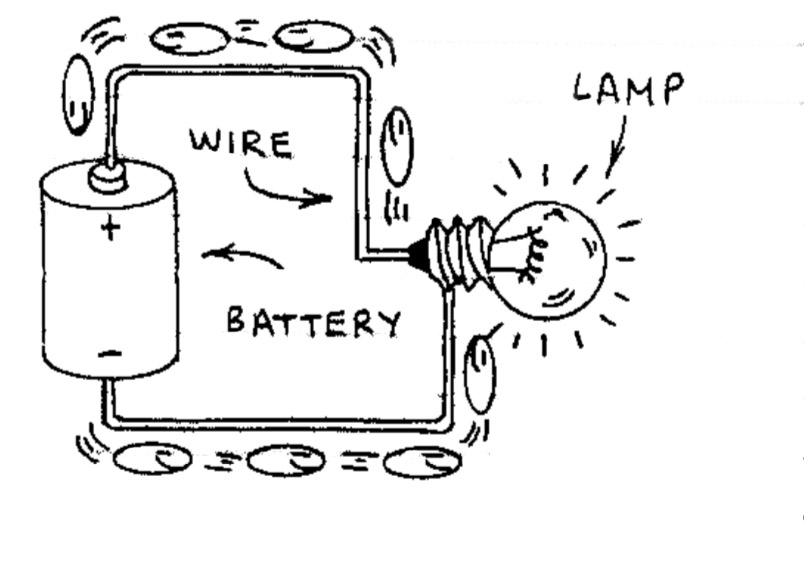
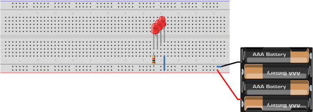
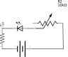
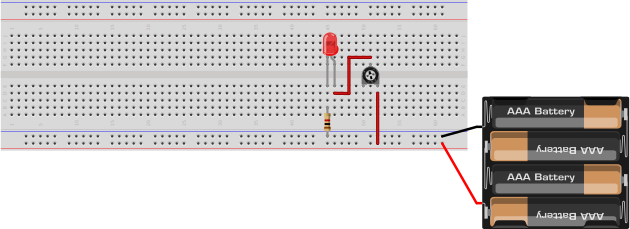

## Electronics Lab Worksheet

Work in groups to complete as many of these circuits as you can. Try to answer the questions found below. Some of the answers won't be immediately apparent.
Leave those blank for now, and try them again after completing the readings for next week.

Your homework for Monday 3/5 is to read pp. 31-71 and pp. 148-192 in _Learn Electronics with Arduino_.

This Lab Worksheet will be due Wednesday 3/7. You may work together in groups, but you should each turn in your own copy of this assignment. Please use this sheet to take notes, then type up and submit your answers in Canvas.

### 1. LED

For our first trick, we'll convert battery power into light energy using an LED (Light-Emitting Diode).

Start by providing connecting the power rails on your breadboard to your power source, using the breadboard power adapter included in your Arduino kit. This will differ slightly from the diagram below.

Make sure that the polarity on your adapter matches the red <small>(+)</small> and blue <small>(-)</small> rails on your board. If not, flip the board around and plug it in on the other side.

| Schematic | Layout |
| ---       | ---    |
| |  |

Now place your LED on the breadboard. Make sure its legs span two channels, like in the diagram above. Use a jumper wire to connect the positive side (long leg) to the positive side of the power rail.

Now you'll need to find a 1KΩ resistor in your kit. You can locate it by color (brown-black-black), or by the number printed on the paper holding each set together. If you have a multimeter available, test it to be sure. Turn your meter's dial to the 2kΩ setting and connect one probe to each end of the resistor. If the screen shows approximately 1.00, you can be sure you've chosen the right part.

Use the resistor to complete the circuit by connecting the negative lead of your LED to the negative side of the power rail. Connect and turn on your power source. The LED should now be lit!

#### Questions:
What happens if you turn the LED backwards? Why do you think this happens?

|

|

|

Why do we include a resistor in this circuit? What would happen if we removed it? (**Don't actually try this!**)

|

|

|

### 2. Switch

Now, let's add a switch that turns the light on or off. Your kit includes switches that are "normally-open" meaning that when they are not being pressed down, they keep the circuit "open" and no current can get through. When you press down on the switch it temporarily "closes" the circuit and current can pass through to the LED. This terminology can be a bit counter-intuitive. it helps to see a diagram of this in operation.

| Closed | Open |
| ---    | ---  |
|  | |  |

We need to add our switch _between_ the positive terminal of the LED and the positive rail of our power source. Place a pushbutton switch on the circuit board, over the trench in the middle. This placement ensures that you are connecting to the right terminals on the switch. Now remove the jumper between the LED and <small>(+)</small>. Instead, connect your LED pin to one side of the switch, and the other side of the switch to <small>(+)</small>

| Schematic | Layout |
| ---       | ---    |
| |  |

Press and hold the button. Your LED should light up whenever the button is pressed.

#### Questions
Try switching up the circuit so that the switch is between the (-) terminal of the LED and ground (-) instead of on the (+) side. Did this change the operation of your circuit? Why or why not?

|

|

### 3. Parallel

We're going to learn two ways to hook up multiple LEDs. The first one is called wiring in parallel. Start by removing the switch you added

| Schematic | Layout |
| ---       | ---    |
| |  |

Find two more LEDs of the same color. Add them to the breadboard as shown above, so that their legs are in line with each other in one of the rows of your breadboard. Keep the resistor and jumper in the same position as before.

Turn on the power, and all the LEDs should light up.

#### Questions
Do you see any difference in brightness between the three LEDs?

|

|

### 4. Series

Now rearrange the LEDs as shown below. The negative terminal of the second and third LEDs should be connected to the positive terminal of the first and second, respectively.

| Schematic | Layout |
| ---       | ---    |
| |  |

#### Questions
Now do you see any difference in brightness between the three LEDs?

|

|

Use a multimeter to measure the voltage at different points in the circuit. Set the meter to '20V'. Touch the negative probe of your meter to ground and the positive probe to one foot of the first LED. Now check the second and third LEDs. Do you see a trend?

|

|

How do these measurements help explain the behavior of this circuit?

|

|

### 5. Resistance

Potentiometers function exactly like a resistor, except that they are adjustable. We can use this to 'dim' our LED by limiting the amount of current that gets to it.

| Schematic | Layout |
| ---       | ---    |
| |  |

Start by removing the extra LEDs from our last experiment.
Find the potentiometer in your kit, as well as the detachable knob. Push the knob into its receptacle, making note of how the flat side matches up with the shape of the hole.

Attach the potentiometer to your breadboard over the center trench. Connect one foot to the power source, and the top lead to the positive terminal of your LED.

#### Questions
Use your meter to measure the voltage at the LED as you adjust the dial on your potentiometer? Do you see any change?

|

|

### 6. Voltage

We can use the same potentiometer to affect voltage instead of current.

| Schematic | Layout |
| ---       | ---    |
| |  |

Adjust your circuit so that one leg of the potentiometer connects to ground, and the other connects to the power source.

#### Questions
Use your meter to measure the voltage at the LED as you adjust the dial on your potentiometer. How is this different from the previous example?

|

|

Why might you prefer this configuration?

|

|

### 7. Logic

This example is more complex, and not required to complete the assignment. It shows an analog circuit with almost as much complexity as some of the projects we'll be building with Arduino microcrontrollers. As we'll learn, it's theoretically possible to do anything you can do with an Arduino with discrete circuits like this one. It just gets complicated very fast, and writing code is a better tool for managing complexity.

This circuit turns on a light when it is dark out, and turns off the light when it is bright. You might use this to build a night light that conserves energy during the day.

If you have time, try building this project.

| Schematic | Layout |
| ---       | ---    |
| |  |
