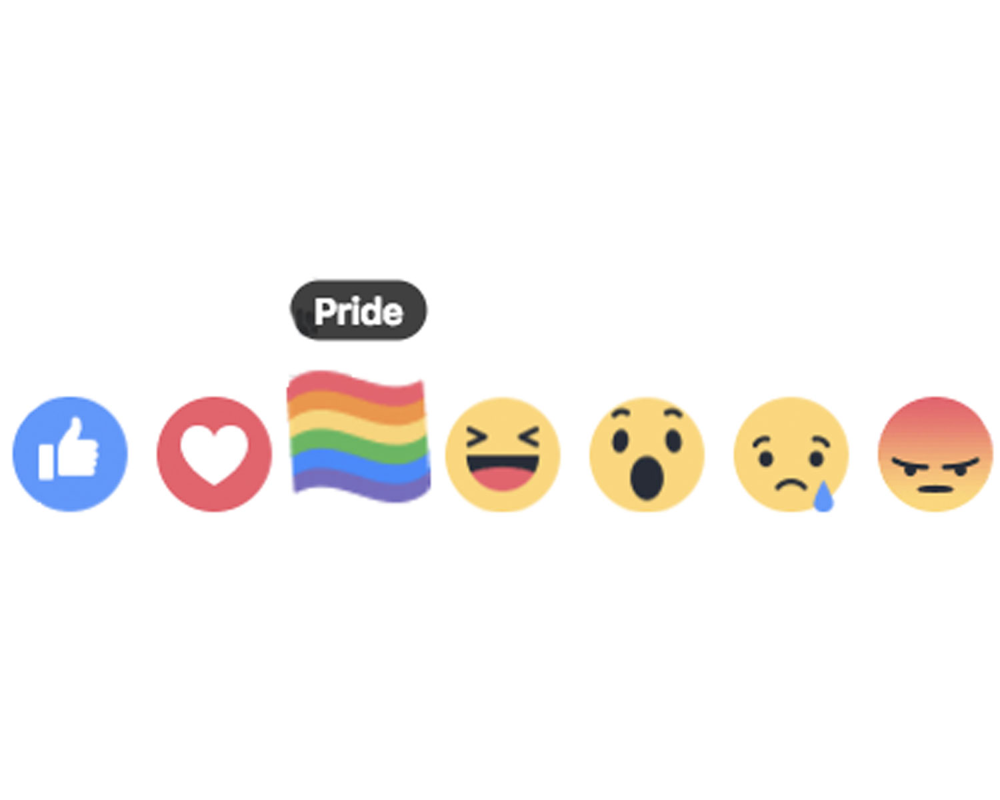
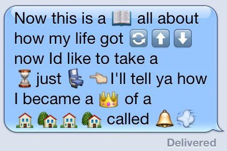
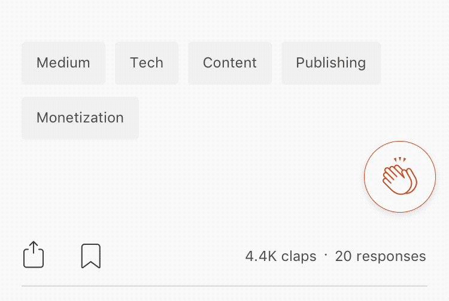
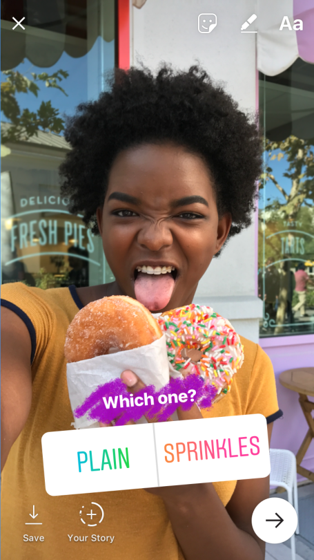

## Project 1: Reactions
#### "Reinvent the like button"

### Overview
Social platforms and messaging apps have become one of the most crucial and widespread uses of technology. Whether they are productivity tools like Slack and Email, feed apps like Instagram and Facebook, or multimedia messaging tools like Snapchat and WhatsApp, our devices facilitate the processes of gossip, coordination, dissent, and social approval largely through clever and context-specific use of shorthand.

One early example of this is adoption of abbreviations ("text-speak") like LOL, TTYL, or RTFM to signify common outcomes in conversation. This was driven in part by limitations of the technology of the time – cell phone keyboards were slow and cumbersome, and individual transmissions were limited to 255 characters. These expressions were part of the _lingua franca_ of early internet users, and eventually became widespread conventions.

Facebook (to my knowledge) was the first to systematize this process by introducing the now-ubiquitous Like button. It was now possible to  "acknowlege" someone's message with just a click, obviating users from the need to come up with individual ways of expressing simple appreciation, or agreement. This also marks the introduction of a new way to measure "engagement" with a post, information that is particularly valuable to businesses who want to market their brand or services.

These interactions have become more complex over time, with the introduction of more nuanced, but still predefined, ways of measuring engagement.

| :0 | xD |
|----|----|
| Facebook allows a variety of reactions to posts. |   |
| Emojis allow users to express highly nuanced and context-specific emotional responses to a post, while employing a limited and standardized vocabulary. | |
| Medium uses a "clapping" interaction to allow users to express the magnitude of their approval. |  |
| Instagram and Snapchat allow users to add "polls" to their stories so viewers can vote on Yes/No or multiple choice questions. |  |

### Design Brief

Your task is to conceive of and prototype a new interaction that could replace or augment the like/love/heart react in a social feed app. You can start from any app or service, either one that you use in your daily life or one of your original creation. If you like, you may start from the Dogspotting demo we have been working on in class.

You should produce a clickable interactive prototype in Framer. Though your prototype should "live" within the context of a larger app or system, you should spend most of your time building the particular reaction you have imagined. Limit the time you spend building the framework of an app around it. In fact, it is fine to start from screenshots of an existing app and have the reaction be the only interactive part of your demo. 

Consider the ways that your idea would change the quality of your users' experience.

- What unmet need does this idea address for people who use this platform?
- How does it change the relationship between users and the owners of the platform?
- How can users engage with this feature in creative ways that you may not have originally intended?
- What behaviors does it encourage or disocurage?
- What kind of emotions does it provoke? Is it joyful to use?

### Timeline

- **Monday Feb 5** Intro assignment in class. Brainstorming activity.
- **Monday Feb 12** Come to class with notes on your idea. I will check in with each of you individually. This is your chance to get feedback on your idea, and suggestions for how to implement a prototype.
- **Wednesday Feb 21** In-class critique. We will load the protypes on computers in the classroom so we can test and offer feedback on each others' projects
